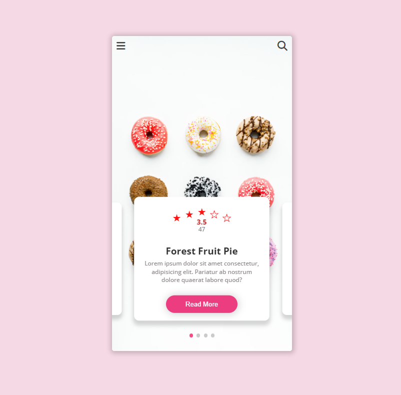

# Account Menu - ICodeThis Challenge

## How to run Locally

1. Clone or fork the repo & place it in your desired location.
2. Then in root directory run the live server insider __VSCODE__.

## Preview

